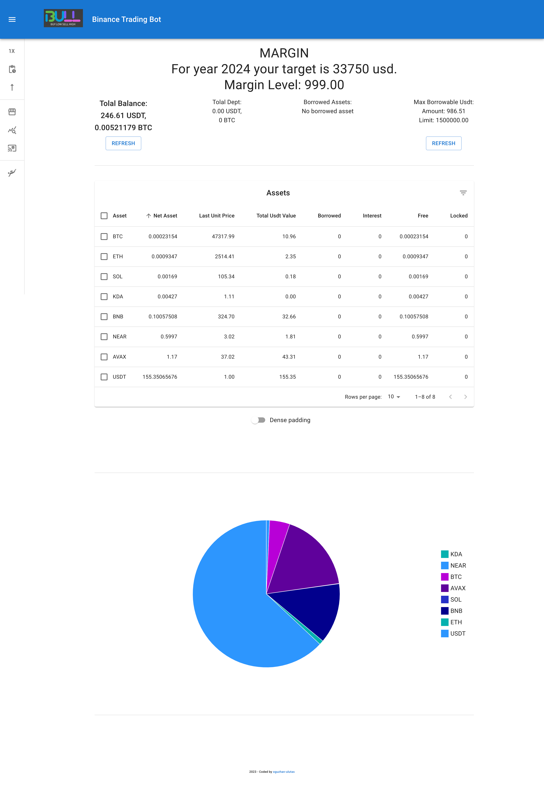
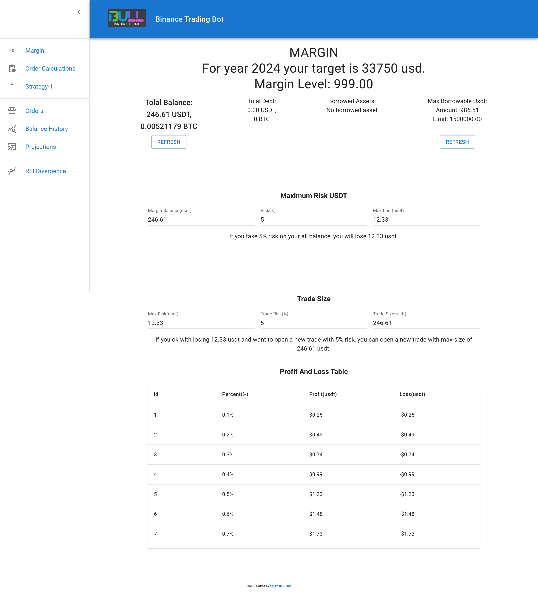
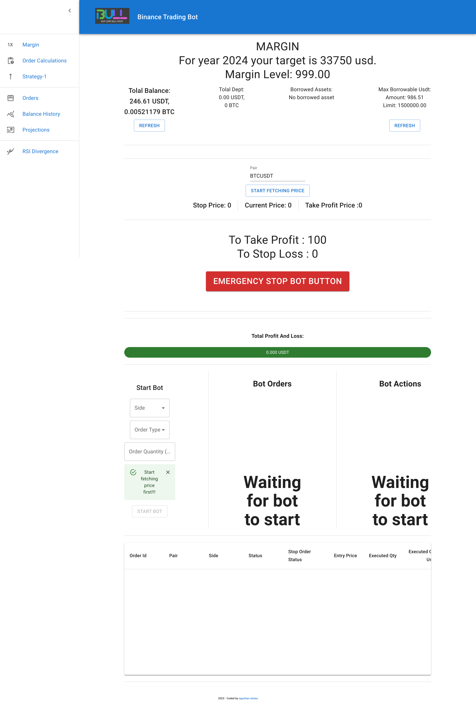
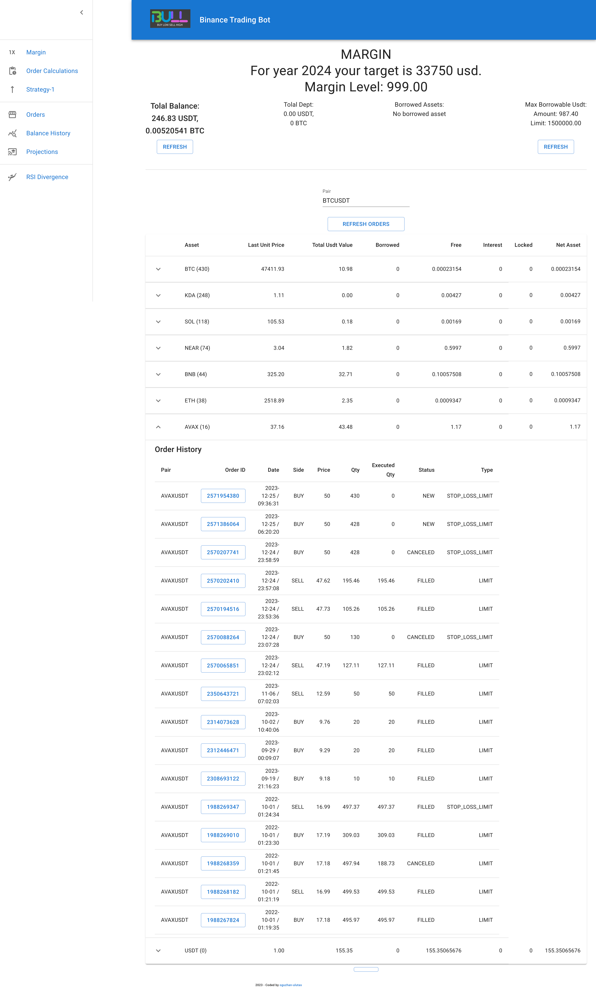
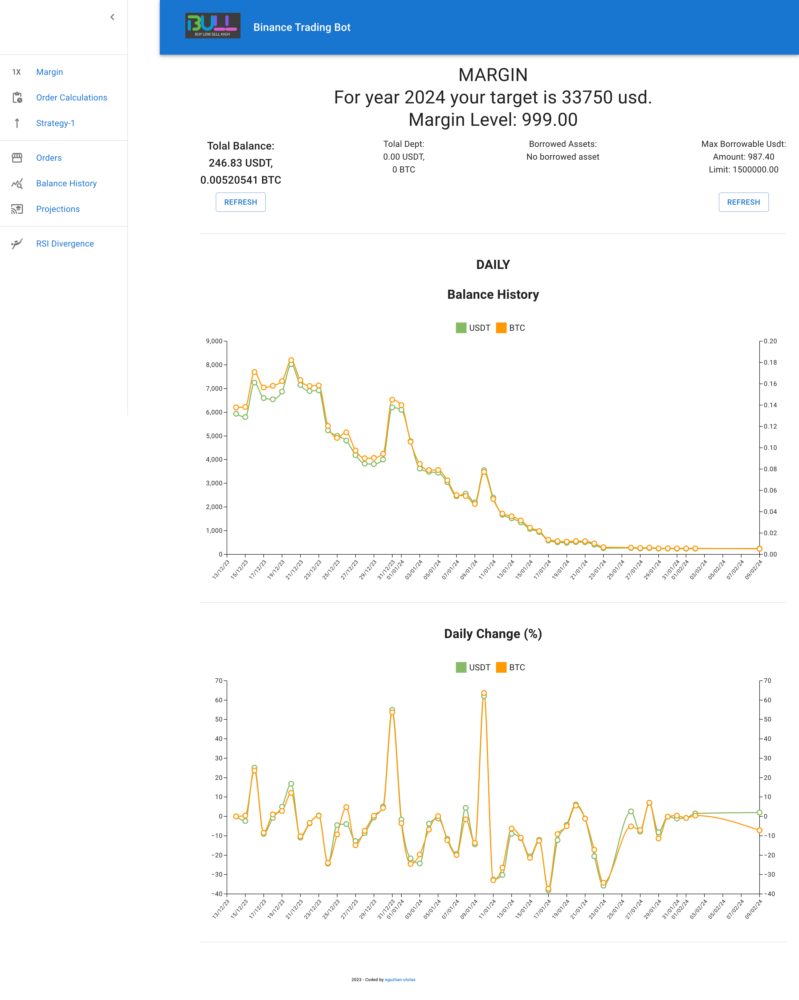
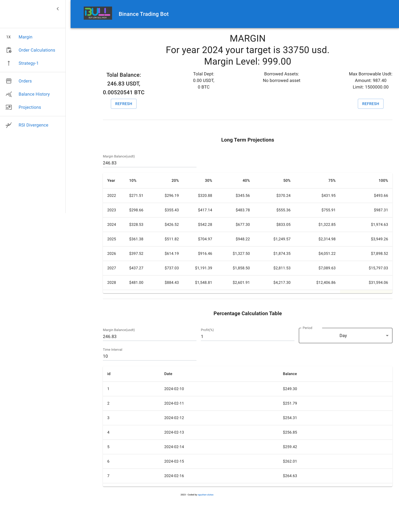

# binance-trading-bot

A trading bot for binance. Still in progress.

## Setup

### Step 1: Environment File Setup

Create .env file in server directory:

- binanceApiKey = "YOUR_BINANCE_PUBLIC_KEY"
- binanceApiSecretKey = "YOUR_BINANCE_SECRET_KEY"
- binanceApiUrl = "https://api.binance.com"
- clientUrl = "http://localhost:5173" If your client url different, make changes accordingly.
- mongoUri ="mongodb://127.0.0.1:27017/binanceData" (your mongodb connection string)

Also create .env file inside the client directory:

- VITE_serverUrl = "http://localhost:3000/binance-api/v1" If your server url different, make changes accordingly.

### Step 2: Dependency Installation

Execute inside the both client and server directories after cloning the repo:

```sh
npm install
```

### Step 3: Launching the Development Server

Execute:

```sh
npm start
```

Or to start the server continuously with nodemon:

```sh
npm run devstart
```

### Step 4: Launching the Client

Inside the frontend folder execute:

```sh
npm run dev
```

## Detailed Info

### Home Page

- It fetchs user data and shows the info of account.
- Shows a pie chart of assets.
- You can refresh any time your assets and max barrowable amount. <br><br>
  

### Order Calculations

- You can use this page to calculate a manual order. It takes all the assets' value and calculates
  5% risk as default. And than you can input your order risk, it will give you the maximum amount of
  trade size. And it shows the profit and loss table. <br><br>
  

### Strategy One

- The strategy is buy or sell from a price, put a stop order with 0.5%. If order stopped the bot stops.
  if the price reaches %0.5 profits, it take profits and places a new order. <br><br>
  

### Orders

- You can reach all of your order history, And detail of any order by clicking the id.<br><br>
  

### Balance History

- You can see all your balance history as graphs, usdt and btc value. <br><br>
  

### Projections

- You can make different kind of projections. <br><br>
  
